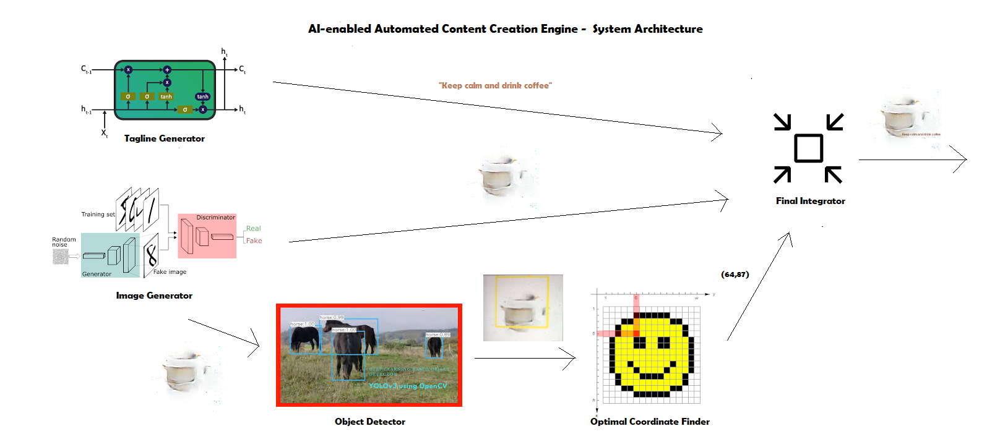

# main_engine_src
AI digital marketing content creation engine built using machine learning and deep learning techniques

Abstract:
Traditional ways of creating a digital marketing material, which usually consists a delicate combination of image and slogan, has been a cumbersome and labor-intensive process incurring high cost for a business. To solve this problem, this project proposes a A.I.-enabled automated content creation engine to generate digital marketing material for a coffee business using advanced machine learning methods. In particular, Generative Adversarial Networks (GANs) including MSG-GAN and a sequence model - Long Short Term Memory have been incorporated in the engine to generate novel image and slogan respectively. The generated image then passes through a object detector module verifying its quality before merging with the generated slogan. Two methods of merging the visual and slogan, namely with or without the involvement of a template, have been tested to combine these two intrinsically different elements in an aesthetic manner. Despite the limited time and computation resources for training the deep learning models in this project, other techniques from computer vision and software engineering have been employed to improve the overall performance of the automated engine. As a result, satisfactory novel elements, albeit with occasional noise and distortions, have been successfully generated before passing to the modules further in the pipeline to generate a final desirable piece of marketing material. Therefore, the novel engine in this work presents a potential means to advance the digital marketing industry by providing more inspirations for professionals and thereby augmenting them with the power of Artificial Intelligence. 

# Build instructions to run the main engine for generating digital marketing materials

1. Install Anaconda (version 3, python 3.7 version for the writing of this report) and pip.
2. Download and decompress the source code.
3. Using Anaconda Prompt, navigate to the main_engine_src directory using command prompt or terminal.
4. Create an environment in Anaconda by running "conda create --name main_engine".
5. Activate the environment just created by running "activate main_engine".
6. Install the gpu version of tensorflow and other libraries using Anaconda by 
   executing the command "conda install tensorflow-gpu keras pandas".
   (Because the GPU hardware requirements are dependent on individual computer, the specific versions required vary. Please
   read the requirements.txt for more information of the specific versions of libraries required)
7. Install the following libraries by executing the command "pip install tensorlayer opencv-python".
8. For downloading the YOLOv3 model, please download the weights through this link:
   https://pjreddie.com/media/files/yolov3.weights (For extra information, 
   please visit this official website: https://pjreddie.com/darknet/yolo/) and
   put the yolov3.weights file into the yolo-coco directory.
9. The engine could then be run by simply executing the command "python main_engine.py -m 2" for running with template
   ("python main_engine.py -m 1" for running without template) and the final generated marketing materials could then 
   be found in the generated_output folder.

Note: There is no an executable for running the main engine (with permission of my project supervisor Prof. Mischa Dohler) because the 
requirements for running the main engine involves a GPU hardware and thus different versions of libraries for running the neural 
networks in different PC, therefore it is best for the user to run with Python following the insturctions stated in the README file of
sub-directory or compile the application by themselves. Another reason for not having an executable is the complexity of the main engine 
which involves multiple neural networks and sub-folders making the creation of a single executable difficult. 
